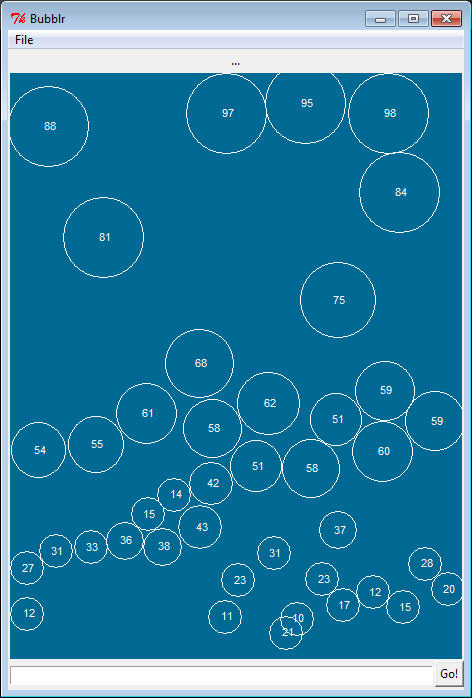

# Bubblr

A JIRA todo list thinger. Creates bubbles that get larger, and thus float higher up, when deadlines are closer.

## Getting Started

Clone the repo and go!

### Prerequisites

```
pip install -r requirements.txt
```

## Usage
At startup Bubblr will create some random bubbles that float around.



In the File menu you can Connect to your JIRA instance, and using the Query bar at the bottom you can insert a JQL Query to get tasks.

The bubbles are going to "weigh" themselves based on some criteria, such as time to deadline or other prioritising factors, with the most pressing issues floating to the top. But I haven't gotten around to implementing that yet...

## License

This project is licensed under the GNU General Public - see the [LICENSE.md](LICENSE.md) file for details.
